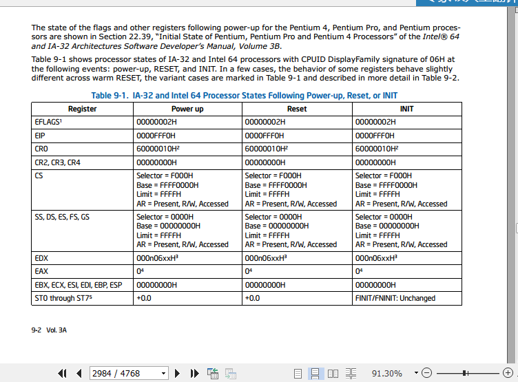
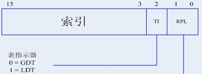

#### Lab 1的实验过程
主要分为4个方面
1. X86的启动顺序
> 这里面涉及到当硬件一启动之后.怎么把操作系统放到内存中去运行
2. C函数调用栈
> 在操作系统里面有很多的C函数之间的调用以及C和汇编 函数之间的调用关系， 那么它在具体细节上面怎么来实现一个函数调用呢？需要我们去了解
3. gcc内联汇编
> GCC是我们编译内核的一个编译器，它里面可以很方便的内联汇编，有了内联汇编之后我们可以在C语言里面嵌入汇编代码，这样就不用单独写一个汇编的一个文件，这是有一些特定的规则，我们需要了解
4. x86-32下中断处理
> 当我们的操作系统启动之后，它很重要的事情就是要能够接管中断，中断有很多功能。uCore的中断主要是指 在X86-32这个硬件下的中断处理是怎么来完成的，它怎么和硬件的这些特征来结合，来完成跟中断相关的一系列的管理工作

### 一. x86的启动过程

#### 1. 起始地址

	关于因特尔不同的处理器表现不同，基本上是80386以后出现的处理器当一加电，相当于做了一次热起之后，那么它首先肯定会有一个初始状态，那么启动地址是什么？
通过查intel 指令手册

可看到CS 和EIP的值
```
CS：
    Selector = F000H
    Base = FFFF0000H
    Limit = FFFFH
    AR = Present, R/W, Accessed
EIP：0000FFF0H
```
但是我们需要注意,当X86一开始加电时候 启动是实模式,早期的为了向下兼容,以前的8086一开始启动是16位的实模式，在这种情况下 **寻址按照实模式的寻址方式(段基地址+段内偏移地址)**
```
CS.Base = FFFF0000H
EIP：0000FFF0H
起始地址=CS.Base+EIP=FFFFFFF0H
```


 段描述符中的S位和TYPE字段（四位）的不同又分为数据段描述符、代码段描述符（S=1）和系统段描述符(S=0)。数据段和代码段描述符类型如图5所示。


实模式下的寻址方式
所以它的寻址CS：IP
其实这个：IP的意思就相当于CS左移了四位
再加上IP形成的地址
这是在实模式情况下的寻址方式


	**起始地址所在的内存是PC中的一个固件叫EPROM**，它所在的一块内存区域中的一个地址需要注意这个地址是只读的一块地址，从这个地址会取得第一条指令，这条指令一般是一条长跳转指令，会跳到BIOS中去做初始化工作。

    总结下：一开始的时候，它会从这么一个特殊的地址会跳到一个可以被访问的1M的内存空间里面去执行；这也是符合我们说的 在实模式环境下,它的寻址空间只有1M的特征;
    
	Lab 1有一个小的练习，就是看看BIOS从第一条指令到底从哪开始执行，跳到哪去。


#### 2. 加载主引导扇区（从BIOS到Bootloader）

    BIOS完成它的工作（硬件的初始化工作底层的硬件初始化工作保证这个机器能够进行后续的正常工作完成很多各种外设，CPU内存的质检等）之后，这个固件会去**加载磁盘或者硬盘的第一个主引导扇区**也就是零号扇区，512字节（一个扇区是512字节），将扇区的内容读到内存0x7c00(固定的位置)处，也就是从0x7c00处开始执行第一条指令，零号扇区 也就是 bootloader, 也是lab1要去做的事情；


#### 3. Bootloader的代码功能

##### 3.1 从实模式切换到保护模式

从实模式的16位的寻址空间切换到了32位的寻址空间，也就是从1M的寻址能力切换到了4G的寻址能力，一旦Enable（使能）了这个保护模式，段机制也就自动的加载上来了

##### 3.2 读取kernel代码
	对于我们的实验，就是要读取uCore的代码
，uCore代码也是存在于硬盘扇区中，在第1或者2等等扇区里，bootloader需要从硬盘里面把uCore的代码,再从我们的硬盘的扇区里面读到内存中的一个固定地址(对于bootloader来说，将EIP设置到这个固定位置即可)，接下来就会从这个固定位置开始执行操作系统(ucore)的第一行代码；这就相当于把控制权交给了uCore_os了,系统也就起来了。

#### 4 段机制 segment
先理清三个概念：
**逻辑地址**：即逻辑上的地址，<font color =red>**实模式下由“段基地址+段内偏移”组成;**</font><font color =blue> **保护模式下由“段选择符+段内偏移”组成。**</font>

**线性地址**：**逻辑地址经分段机制后就成线性地址，**它是平坦的;如果不启用分页，那么此线性地址即物理地址。

**物理地址**：**线性地址经分页转换后就成了物理地址。**

**保护模式寻址方式**
    在定义“逻辑地址”时看到保护模式和实模式的区别在于它是用段选择符而非段基地址，这也许就是保护模式的真谛所在，从段选择符入手，全面理解保护模式编程基本概念和寻址方式。

**分段机制**
    下面来看下**保护模式是怎样通过“段选择符+段内偏移”寻址最终的线性地址或物理地址的。**


图1逻辑地址到线性地址转换，这里的逻辑地址即指保护模式下的“段选择符+段内偏移地址”，如果不启用分页管理的情况下，那么此线性地址即最终的物理地址。

图1逻辑地址到线性地址转换

    在理解此图时必须要明白段选择符结构，描述符表概念等，下面就一一介绍。

如图2段选择符结构，段选择符为16位，它不直接指向段，而是通过指向的段描述符，段描述符（一会介绍）再定义段的信息


图2段选择符结构

**RPL**表示0 1 2 3四个请求特权级或者请求优先级
那我们一般说我们操作系统放在最高的级别是0特权级

**TI**用来指明全局描述符表GDT还是局部描述符表LDT，索引值为13位，所以从这里看出，在保护模式下最多可以表示2^13=8192个段描述符，而TI又分GDT和LDT（如图3所示），所以一共可以表示8192*2=16384个段描述符，每个段描述符可以指定一个具体的段信息，所以一共可以表示16384个段。而图1看出，段内偏移地址为32位值，所以一个段最大可达4GB
$$2^{32} = 2^{{10}*3+2} = 1024 * 1024*1024 *4 = 4GB$$
这样16384*4GB＝64TB，这就是所谓的64TB最大寻址能力，也即逻辑地址/虚拟地址。

<font color=red>ucore_os 只用到了全局描述表</font>


    在保护模式实际编程中，如下一条语句：jmpi 0, 8。其中的8即段选择符，8的二进制表示为：0000 0000 0000 1000b，所以这条语句的意思是跳转到GDT表（TI＝0）中的第2个（段描述符表从０开始编号，所以这里的1指表中的第2个）段描述符定义的段中，其段内偏移为0。


段描述符中的S位(位12)和TYPE字段（四位，8,9,10,11）的不同又分为（数据段描述符,代码段描述符（S=1））和系统段描述符(S=0)。

|类型|位12|位11|
|--|--|--|
|数据段描述符|1|0|
|代码段描述符|1|1|
|系统段描述符|1|0或1不同含义|


第一个就是基址（Base）在什么地方
第二个这个段的长度（Limit）是多大
我们也讲到了 在uCore里面把这个功能给它弱化
基址都是零 段的长度都是4G
ucore 里面，将段描述符中的 段基地址 设置为0，<font color=red>段的长度限制符（Limit） 设置为4G</font>


**段的长度限制符（Limit）结构**：
第一个4bit,第二个16bit, 一共$$$2^{20}=1024*1024=1MB$$$
的空间大小,<font color=red>那怎么设置为4G？后续需要关注下</font>


**如何进入保护模式：**
**答：系统寄存器CRO(或者控制寄存器)
对于这个寄存器把它的第0号bit置成1
那么就意味着现在的系统,我们的CPU就会进入到保护模式**

进入了保护模式之后
Bootloader要干第二个很重要的事情，**就是要加载uCore OS**
那我们的uCore OS编译出来
后面会给大家讲Demo这个的源代码
**编译完之后**会生成一个**elf格式**的一个执行程序
elf格式的执行程序是我们在Linux里面
很常用的一种执行文件的格式，ELF里面有一个，叫ELFheader的结构体，里面的   uint32_t e_phoff; 它是这个ELFheader的偏移地址，uint16_t e_phnum; 这是偏移数量；

```
struct elfhdr {
    uint32_t e_magic;     // must equal ELF_MAGIC
    uint8_t e_elf[12];
    uint16_t e_type;      // 1=relocatable, 2=executable, 3=shared object, 4=core image
    uint16_t e_machine;   // 3=x86, 4=68K, etc.
    uint32_t e_version;   // file version, always 1
    uint32_t e_entry;     // entry point if executable
    uint32_t e_phoff;     // file position of program header or 0
    uint32_t e_shoff;     // file position of section header or 0
    uint32_t e_flags;     // architecture-specific flags, usually 0
    uint16_t e_ehsize;    // size of this elf header
    uint16_t e_phentsize; // size of an entry in program header
    uint16_t e_phnum;     // number of entries in program header or 0
    uint16_t e_shentsize; // size of an entry in section header
    uint16_t e_shnum;     // number of entries in section header or 0
    uint16_t e_shstrndx;  // section number that contains section name strings
};
```

代码段的头结构体信息
```
/* program section header */
struct proghdr {
    uint32_t p_type;   // loadable code or data, dynamic linking info,etc.
    uint32_t p_offset; // file offset of segment
    uint32_t p_va;     // virtual address to map segment
    uint32_t p_pa;     // physical address, not used
    uint32_t p_filesz; // size of segment in file
    uint32_t p_memsz;  // size of segment in memory (bigger if contains bss)
    uint32_t p_flags;  // read/write/execute bits
    uint32_t p_align;  // required alignment, invariably hardware page size
};
```
代码段的头结构体需要注意：
uint32_t p_va;     这是虚地址的位置，是运行编译后的代码的位置
uint32_t p_memsz;  是这个代码段的大小


**我们这边还没讲到文件系统,bootloader它读的是什么？**
答：其实它读的是最原始的磁盘扇区，它是把一个一个的磁盘扇区，刚才说的Bootloader之后的连续的磁盘扇区，连续读了四个磁盘扇区 读到内存里面来
然后开始完成相应的分析工作；


参考资料：
1. https://blog.csdn.net/rosetta/article/details/8933200
2. 清华大学ucore_os课程：http://www.xuetangx.com/courses/course-v1:TsinghuaX+30240243X+sp/courseware/eeab809fe92d45549033de97f84d8a7c/