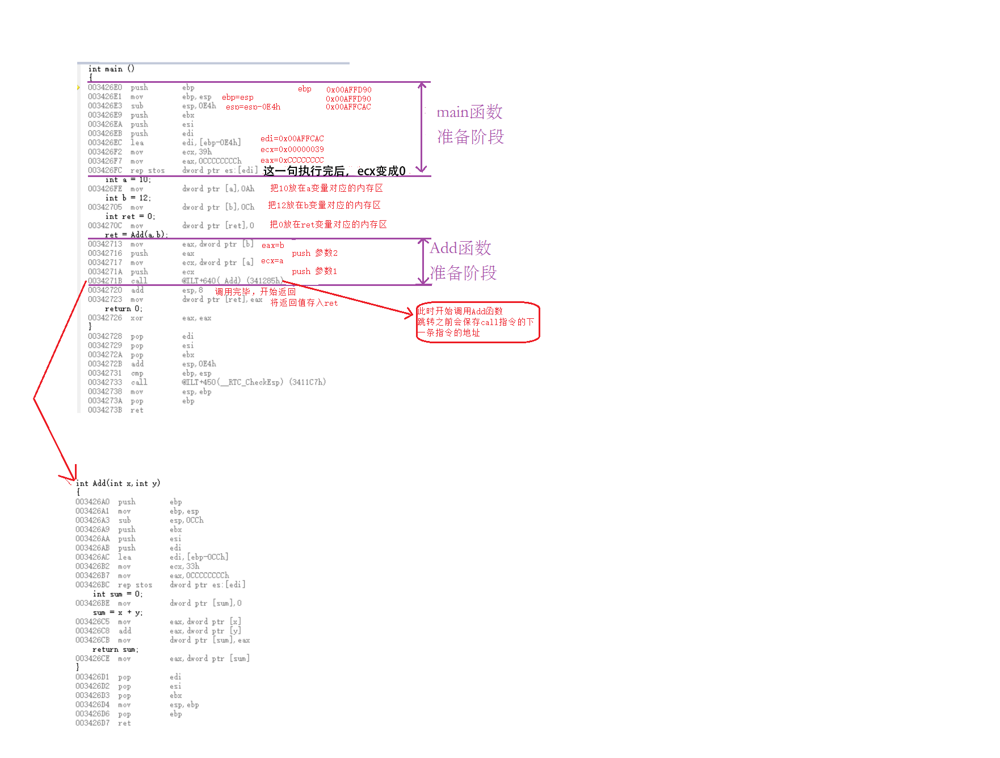
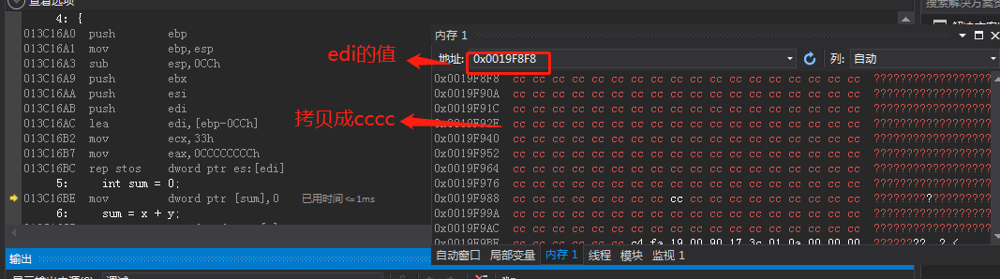
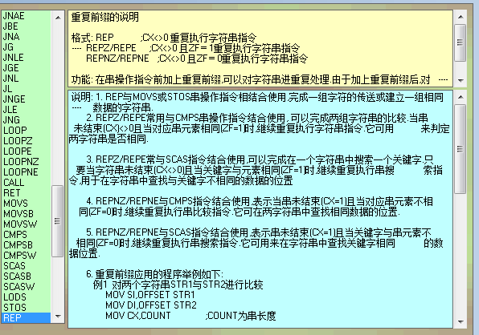
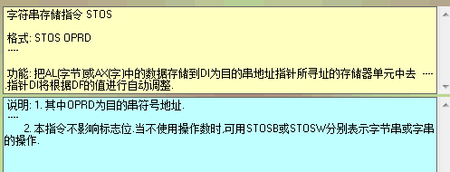

## 第二部分 了解函数调用关系

#### 1. c函数调用的实现
这一层的分析是在我们机器码这一级来分析的，也就是汇编语言这一级；
先看几个函数调用过程涉及到的寄存器： 
（1）esp：栈指针寄存器(extended stack pointer)，其内存放着一个指针，该指针永远指向系统栈最上面一个栈帧的栈顶。 
（2）ebp：基址指针寄存器(extended base pointer)，其内存放着一个指针，该指针永远指向系统栈最上面一个栈帧的底部。 
（3）eax 是”累加器”(accumulator), 它是很多加法乘法指令的缺省寄存器。 
（4）ebx 是”基地址”(base)寄存器, 在内存寻址时存放基地址。 
（5）ecx 是计数器(counter), 是重复(REP)前缀指令和LOOP指令的内定计数器。 
（6）edx 则总是被用来放整数除法产生的余数。 
（7）<font color=red>esi/edi分别叫做”源/目标索引寄存器”(source/destination index),因为在很多字符串操作指令中, DS:ESI指向源串, 而ES:EDI指向目标串. </font>
在32位平台上，ESP每次减少4字节。 
再看几条简单的汇编指令： 
mov ：数据传送指令，也是最基本的编程指令，用于将一个数据从源地址传送到目标地址（寄存器间的数据传送本质上也是一样的） 
sub：减法指令   eg: sub esp,0E4H  ;esp = esp-0E4H
lea：取偏移地址 
push：实现压入操作的指令是PUSH指令 
pop：实现弹出操作的指令 
call：<font color=red>用于保存当前指令的下一条指令并跳转到目标函数。  它是两步操作，1.将当前的IP或CS和IP压入栈中 2 .jmp指令，做转移，还需要注意，call不能实现短转移</font>
add: 加法指令 eg: add esp,0E4H  ;esp = esp+0E4H
附上寄存器的英文全称，方便记忆：
AH&AL＝AX(accumulator)：累加寄存器
BH&BL＝BX(base)：基址寄存器
CH&CL＝CX(count)：计数寄存器
DH&DL＝DX(data)：数据寄存器
SP（Stack Pointer）：堆栈指针寄存器
BP（Base Pointer）：基址指针寄存器
SI（Source Index）：源变址寄存器
DI（Destination Index）：目的变址寄存器
IP（Instruction Pointer）：指令指针寄存器
CS（Code Segment）代码段寄存器
DS（Data Segment）：数据段寄存器
SS（Stack Segment）：堆栈段寄存器
ES（Extra Segment）：附加段寄存器
OF overflow flag 溢出标志 操作数超出机器能表示的范围表示溢出,溢出时为1.
SF sign Flag 符号标志 记录运算结果的符号,结果负时为1.
ZF zero flag 零标志 运算结果等于0时为1,否则为0.



```
00181732  mov         ecx,30h   ;将ecx的值变成0x00000030h
00181737  mov         eax,0CCCCCCCCh  ;int 3中断
0018173C  rep stos    dword ptr es:[edi]   ;将eax的值拷贝到es:[edi]地址中，拷贝ecx次，直至ecx为0
```
es:[edi] es=0, edi=0x0019F8F8,执行完毕后结果如下：

**REP**可以是任何字符传指令(CMPS, LODS, MOVS, SCAS, STOS)的前缀. 
REP能够引发其后的字符串指令被重复, 只要ecx的值不为0, 重复就会继续. 
每一次字符串指令执行后, ecx的值都会减小.

**stos((store into String)**，意思是把eax的内容拷贝到目的地址。
用法：stos dst，dst是一个目的地址，例如：stos dword ptr es:[edi]。dword ptr前缀告诉stos，一次拷贝双字(4个字节)的数据到目的地址。为什么一次非要拷贝双字呢？这和eax寄存器有关，到底神马关系，慢慢道来。。
执行stos之前必须往eax(32为寄存器)放入要拷贝的数据。上图中，<font color=red>eax的内容是cccccccc，不用说都明白int3中断</font>。
这段代码是初始化堆栈和分配局部变量用的，往分配好的局部变量空间放入int3中断的原因是：防止该空间里的东东被意外执行。


过程描述： 
1、参数拷贝（参数实例化）。 
2、保存当前指令的下一条指令，并跳转到被调函数。 
这些操作均在main函数中进行。

接下来是调用Add函数并执行的一些操作，包括： 
1、移动ebp、esp形成新的栈帧结构。 
2、压栈（push）形成临时变量并执行相关操作。 
3、return一个值。 
这些操作在Add函数中进行。

被调函数完成相关操作后需返回到原函数中执行下一条指令，操作如下： 
1、出栈（pop）。 
2、回复main函数的栈帧结构。（pop ） 
3、返回main函数 
这些操作也在Add函数中进行。 至此，在main函数中调用Add函数的整个过程已经完成。 
总结起来整个过程就三步： 
1）根据调用的函数名找到函数入口； 
2）在栈中审请调用函数中的参数及函数体内定义的变量的内存空间 
3）函数执行完后，释放函数在栈中的审请的参数和变量的空间，最后返回值（如果有的话） 


三种调用约定：

_stdcall调用约定

所有参数按照从右到左压入堆栈，由被调用的子程序清理堆栈

_cdecl调用约定（The C default calling convention，C调用规定）

参数也是从右到左压入堆栈，但由调用者清理堆栈。

_fastcall调用约定

顾名思义，_fastcall的目的主要是为了更快的调用函数。它主要依靠寄存器传递参数，剩下的参数依然按照从右到左的顺序压入堆栈，并由被调用的子程序清理堆栈。


