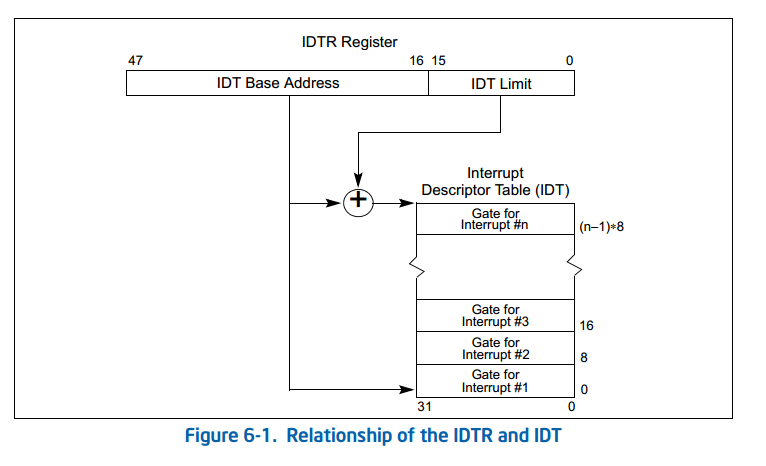
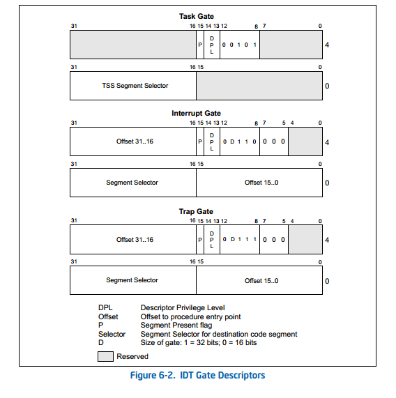
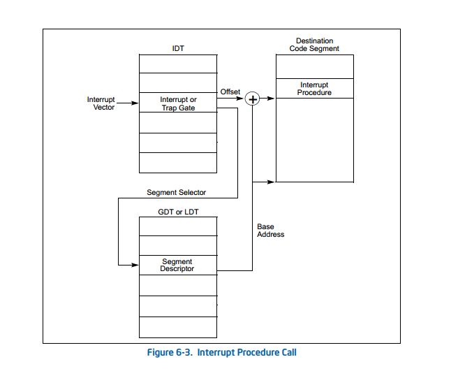

### X86中的中断处理的过程

这里面会涉及到三部分
* 了解X86的中断源
* 了解是CPU和操作系统软件和硬件如何处理中断
* 中断向量表(中断描述符表，简称IDT)，进行初始化

#### 一. 中断源  分为中断和异常两类
#### 中断  Interrupts
1. 外设(包括了硬盘 网卡 时钟 串口等等)中断
2. 软件中断(Software generated interrupts):The INT n指令，通常用于系统调用，应用程序可以通过软中断来获得我们操作系统提供的服务

#### 异常 exceptions

1. 程序错误--外部中断？
2. 软件产生的异常(Software generated exceptions INTO, INT 3 and BOUND) 内部中断？
3. 机器检查出的异常--异常

比如说举个简单例子
网卡产生的中断 那它得到了一个数据包产生了中断，那我们操作系统就应该对这个数据包做进一步的处理，来发给相应的应用程序，需要这个数据的应用程序去做操作，这实际上是我们操作系统干的一个事情，它需要去做相应的响应。

那如果说是一个异常产生了
那么异常产生之后呢，我们的操作系统要根据这个异常的严重程度，才能把运行的这个程序 我们称之为进程，把这个进程给kill掉，给杀死，也有可能是我们的应用程序产生的软中断，那我们的操作系统就可以去完成这个服务，最终让我们的应用程序可以得到这样的服务
这是不同的处理方式
那无论哪种方式 其实一个中断 异常
或者说是我们称之为的软中断

### 二.确定中断服务例程
全称为：Interrupt Service Roution,简称ISR

无论是硬中断，软中断，都会对应一个中断号，这个中断号唯一标示了这一个中断的特征，对于每一个中断号, 都有相应的中断处理的一个例程,来完成对应的操作

这个是我们操作系统需要去建立好的每一个中断或者异常都有一个中断服务例程,简称ISR 就是Interrupt Service Routine;这个关联关系存储在中断描述符表(Interrupt Descriptor Table,IDT)

需要明确两个概念：
* **中断服务例程**：多个设备可能会产生同一个中断，也就是一个中断号对应多个处理例程，产生的时候，通过这个中断服务例程，来决定到底调用哪一个处理例程；
* **中断处理例程**：中断号对应的处理的例程，软中断一般是在内核里提供处理例程，硬件中断，如USB，网卡等，是由硬件驱动程序提供处理例程，两个硬件可能产生同一个中断号的中断处理例程，他们在链接到os的时候，跟硬件中断的接口部分（IDT）被os把持着，驱动的作者不可能去覆盖现有的IDT entry。只能通过os提供的接口，比如request_irq去注册自己的处理程序，本质上是个callback，等到硬件产生中断了，再通过中断服务例程来决定调用哪个硬件的中断处理例程

**中断的处理过程**：

IDT的起始地址和大小保存在中断描述符表寄存器IDTR中；

它有一个IDT 就是中断描述符表
跟我们刚才看到这个全局描述符表很类似
只是它专门用来描述中断的
这里面也是一个大的数组
里面的每一项我们称之为中断门(或者陷阱门)
trap就是我们说的软中断
中断门或者陷阱门对应相应的中断号
一个中断号可以有一个index
我们根据这个中断号
可以找到它所谓的一个中断门或者陷阱门
基于这个中断门或者陷阱门
我们可以进一步获取到
跟这个中断门 陷阱门相关的段的选择子
我们前面讲的段机制里面 有段的选择子和它的段类的偏移
有了这两个信息 我们就可以知道
一个中断服务例程的地址 就在这里面得到了表述
所以说可以看到 IDT结合我们刚才看到的GDT两个合在一起
就可以完成硬件的中断
或者是异常和中断服务例程对应的链接关系的建立
就可以搞定了
那么这个表本身呢 它有一个起始地址
放在IDTR里面去
需要告诉我们的机器
告诉我们的CPU说你这个IDT在什么地方
所以说可以看出来
这个IDT也是需要我们的操作系统来建立的
这是第一个
第二个它的起始地址
要通过一个特定的指令来告诉我们的CPU
说这个IDT在什么地方
那么我们后面会讲到
要怎么来完成相应的工作
好 对于刚才提到的IDT表中的每一项
我们称之为中断门或者陷阱门呢
它有它相应的格式
这里面最主要的两个一个是段选择子
第二个是它的offset 这两块
这两个信息其实也就意味着
它的中断服务例程的起始地址是知道的了
这是一个大致的一个展示图
产生了一个中断之后
根据这个中断我们可以知道它的中断号
CPU会根据这个中断号来查这个IDT到底属于哪一项
知道它的index
找到相应的中断门或者陷阱门
然后从这里面取出它的段选择子
以这个选择子作为index进一步查找GDT
我们前面讲了GDT 就是全局描述符表
既然它作为index来查 查什么东西呢
GDT里面存的是什么呢
存的是段描述符
段描述符里面有一个基地址 Base address
再加上它谁在里面存的Offset
合在一起就形成了相应的线性地址
从而可以指向我们说的ISR 中断服务例程
所以说一旦产生了某一个中断
CPU可以自动的在硬件这个层面访问这两个表
需要注意这两个表 是我们uCore建立好的
一旦建立好之后 那我们的CPU就可以基于这两个表
来查到相应的中断需要对应的中断处理例程
当然这个例程是我们操作系统来实现的
这样可以确保 一旦产生了某个异常
或者某个中断之后
我们的操作系统能够及时的响应
去调用相应的函数来完成相应的处理
这就是中断处理的初始化的过程

另一方面需要注意的是 当产生中断之后
中断会打断当前正在执行的程序
然后去执行刚才说到的中断服务例程
执行完毕之后再返回到当前被打断的程序继续让这个程序去执行
那么这有一个打断和恢复 就是打断就需要一个保存
最后要返回去要恢复 这么一个过程
那么我们前面讲到了 在不同的特权级
它的处理方式是不一样的
特权级是由谁来决定的 是我们的段描述符里面会有看到
那么段描述符里面会设定它到底处于哪个特权级
比如说我们的CS它的低两位
它如果低两位是0 代表是运行在内核态
那么CS它的最低两位是3
代表运行在用户态
在内核态产生的中断依然在内核态
但是在用户态产生的中断也会跳到内核态里面去
那这是两种不同的方式
因为这里面产生了特权级的变化
对于这种特权级变和没变呢
中断的保存与恢复也是不一样的
我们可以看一看 这边是代表是说产生了中断之后
在同一个特权 意味着在内核态里面产生的中断依然在内核态
这时候会发生什么变化
第一个可以看到 它的Stack
它的栈还是用同一个栈
没有发生变化 只是在这个栈上面压了一些寄存器内容
被打断的那一刻寄存器的内容
第一个是什么呢
可以看到有Error code
这个Error code代表是特意的严重的异常
不是每一个中断或者异常都会产生Error code
第二个会压入EIP和CS
是当前被打断的那个地址
或者是当前被打断的下一条地址
第三个是EFLAGS
当前被打断的时候的标志性的内容
第三个是由我们的硬件
一旦产生中断的时候硬件会压栈压进去
但可以看到它是压在同一个栈里面
第二个如果说当发生中断的时候处于不同特权级
意味着产生中断那一刻 我们的应用程序正在用户态执行
在用户态执行的时候 我们可以看到
第一从用户态到内核态
他们用的是不同的栈
Stack1 Stack2 用的是不同的栈
所以说当由于特权级变化产生了中断的时候呢
除了压刚才说的那些内容之外
还有很重要的两个信息是ESP和SS
这两个内容是当时产生中断的时候
在用户态里面的那个栈的地址
就是SS和ESP
可以看出来它们有很大的区别
很明显在执行完毕要恢复的时候
对于这边而言
它还是恢复到同一个特权级
还是在同一个栈里面继续往下走
对于这边而言呢
它一旦恢复到用户态去执行
也会产生变化 不会用内核态去执行
这是不同特权级下 中断切换对堆栈的影响
给大家做一个简单的介绍
那么X86 当它完成中断服务例程处理完之后
我们还需要返回到被打断程序继续执行
这里面对于中断服务例程来说
它会通过一个iret指令来完成这个返回
但对于我们通常的程序来说
它是通过ret和retf完成函数的返回
而这个是中断服务例程的返回
也意味着他们的处理方式是不一样的
对于没有改变特权级的方式我们可以看到
它其实是把在同一个栈里面
把这个弹出
根据CS和EIP 来跳到当前被打断那个地方继续执行
同时还要恢复它的Eflage的值
这是iret弹出来的时候干的事情
但对于ret而言 它只是弹出了EIP
跳到当时调的那个下一条指令去执行
对retf而言 除了弹EIP之外
还会把CS也给弹出来 恢复CS
实行一种远程跳转的功能
这是他们处理不同
当然这里面说到的是
对于没有特级变化的情况的中断的返回
对于特权级变化的中断的返回会我们可以看到
它弹出的东西更多 这些都要恢复
EIP CS EFLAGE还有 ESP SS
当这个中断服务例程要返回的时候
它需要完成这个弹出的工作
从而可以确保被打断的用户态的程序能够正常地继续执行
不受到影响
当然其实这里面还需要注意
这只是硬件完成的功劳
如果中断服务例程需要对其它寄存器进行修改的话
那么在修改之前 你的中断服务例程需要把寄存器保存起来
在快结束的时候 在iret返回的时候
需要把寄存器恢复回来 然后再恢复这些寄存器
从而可以确保 跳回到这个被中断的应用程序时
程序执行的时候才可以正确执行
大家可以想像 万一这里面的某一个寄存器的值
由于中断服务例程的改变发生了改变
其实你就不能保证我们的应用程序
能够按照它没打断的那样去继续执行了
这实际上说的是中断服务例程要完成的工作
可以看出来 它很重要的是要完成
整个这个被打断程序的一个状态的保存与恢复
这是由我们的硬件 这是硬件自动干的
还有一部分没有描述 我们的软件 我们的操作系统
在中断服务例程处理过程中需要去保存和恢复的
这是通过这两块的结合
才能够确保整个的中断处理过程的正确的执行
接下来我们再看一下
通过中断处理来实现所谓的系统调用
系统调用其实可以理解为一种特殊的中断
它称之为trap 陷入 或者叫软中断
有不同的称呼方式
我们这里面可以看到
我们的应用程序通过系统调用访问OS的内核服务
这一段按照它的实现来说
应该属lab5的内容
直到有了用户态的进程之后
才会通过系统调用来获得OS的服务
但是这里面给大家做个简单的介绍
因为从具体的实践上来说
系统调用的这个机制的建立 和我们中断机制的建立
其实是很接近的 基本上没什么区别
只有一点微小的差别
在实践上面需要考虑 需要如何指定中断
如何完成从用户态到内核态的切换
以及从内核态回到用户态去
这一块有些特殊的一些方法
或者是你通过一种特殊的指令
SYSENTER或者SYSEXIT
这种特殊的新的一些机器指令可以完成相应的功劳
我们在uCore用的还是传统的嵌入的方式
比如说int 80
这种通过软中断的方式来完成系统调用
但是为了完成系统调用
你需要在建立IDT 中断描述符表的时候
要对此要特殊考虑
这跟其他的中断的处理不太一样
因为这里面很明确的指出了是从用户态执行int80
或者int 某一个数能够切换到内核态
它有一个从低优先级到高优先级的转变
这个机制需要我们在IDT表里面
给它设置好相应的权限才能够完成这种转变
好 那我们可以看到
后面的demo也会给大家做进一步的讲解
这是相关的一些参考资料
那我们这里面大量的出现的这个
IA-32 Architectures Software Developer's Manual
这是一个Intel英文的文档 很详细
但是也比较琐碎
也希望大家有时间的话
可以去仔细看一看
相信对你这个代码的理解会有更深入的一个掌握

好 那我们最后来小结一下
我们可以看到
在Lab 1里面我们介绍到其实很多还都是基本的知识
还没有真正讲代码
那我们后面在demo会给大家做一个代码的讲解
可以看到 我们需要去理解保护模式 段机制
从而可以知道我们的uCore操作系统启动之后
处于一种什么样的运行状态
它怎么被我们的Bootloader给加载到内存当中去的
第二个 操作系统中它怎么来完成函数调用关系
怎么来建立这个函数的调用站
其实这实际上靠我们的编译器GCC来完成的
但是我们可以通过一种方法
在我们Lab 1里面需要能够把这个
GCC建立的调用栈给展示出来
展示出来之后 便于我们后续的
对这个出现错误的时候 或者说对它进行一些更深入的理解
知道函数调用怎么产生的
它为了完成某个事情 它调用了多少函数
形成了怎么一个调用关系
这实际上是说C函数调用是需要去了解的
另外 我们也知道操作系统用到很多的一些特权指令
而这些特权指令或者机器指令呢
没法用C语言来表述
为此可以用汇编语言 或者用内联汇编
在C的文件里面嵌入一些汇编
更简洁的实现一些特定的功能
比如说加载页表 加载全局描述符表 加载中断描述符表等等
这些都可以通过内联汇编来实现
为此给大家介绍了一下内联汇编大致的含义
使得大家在阅读这个uCore代码
特别是碰到内联汇编的时候不会感到陌生
知道它大致的一个含义
最后给大家介绍一下关于X86下面的中断处理机制
这也是我们Lab 1里面一个很重要的环节
知道怎么中断建立的
一个外设产生的一个中断
或者应用程序产生的异常等等
那我们应该有一套机制能够应对这种情况
能够及时的响应这种情况
正确的响应这个外设的请求
或者是说能够及时的处理这些异常 错误的状态
这都是我们操作系统去完成的功能
所以在这里面呢
给大家做了一个简单的介绍
看看在X86硬件情况下
怎么能有效的去对它进行管理
好 这也是我们Lab 1的基本知识的部分
谢谢大家

参考资料：
1. https://bbs.csdn.net/topics/391066991